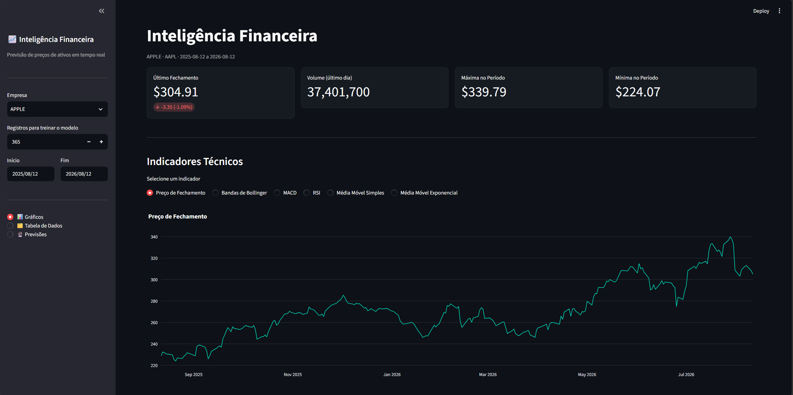

# 📈 Inteligência Financeira

Aplicação web interativa construída com **Streamlit** para análise técnica e previsão de preços de ativos financeiros em tempo real, utilizando dados históricos obtidos via **Yahoo Finance**.


---



---
## 🧭 Visão Geral

O **Inteligência Financeira** permite que o usuário selecione uma empresa listada em bolsa (Apple, Google, Microsoft, Tesla, Netflix, Meta), visualize indicadores técnicos clássicos sobre o histórico de preços e gere previsões de curto prazo utilizando um modelo de regressão linear treinado sobre os próprios dados históricos do ativo.

A aplicação é dividida em três páginas principais, navegáveis pela barra lateral:

| Página | Descrição |
|---|---|
| 📊 **Gráficos** | Visualização de indicadores técnicos (Bollinger, MACD, RSI, SMA, EMA) |
| 🗂️ **Tabela de Dados** | Últimos registros do período selecionado em formato tabular |
| 🔮 **Previsões** | Previsão de preços futuros via Regressão Linear |

---

## ✨ Funcionalidades

- **Seleção de ativo** entre 6 grandes empresas de tecnologia (facilmente extensível)
- **Período customizável** de coleta de dados via calendário na sidebar
- **Cache inteligente** dos dados baixados (1 hora de TTL) para evitar chamadas repetidas à API
- **Métricas em tempo real**: último fechamento, variação percentual, volume, máxima e mínima do período
- **Indicadores técnicos**:
  - Preço de Fechamento
  - Bandas de Bollinger
  - MACD (Moving Average Convergence Divergence)
  - RSI (Relative Strength Index)
  - Média Móvel Simples (SMA)
  - Média Móvel Exponencial (EMA)
- **Modelo preditivo** de Regressão Linear com padronização dos dados (`StandardScaler`) e avaliação via **R²**
- **Gráficos interativos** com Plotly, em tema escuro, responsivos e com legendas horizontais
- **Interface customizada** com CSS injetado para cards de métricas mais elegantes

---

## 🛠️ Stack Técnica

| Categoria | Tecnologia |
|---|---|
| Interface | [Streamlit](https://streamlit.io/) |
| Dados de mercado | [yfinance](https://pypi.org/project/yfinance/) |
| Visualização | [Plotly](https://plotly.com/python/) |
| Indicadores técnicos | [ta](https://technical-analysis-library-in-python.readthedocs.io/) |
| Machine Learning | [scikit-learn](https://scikit-learn.org/) (Regressão Linear) |
| Manipulação de dados | [pandas](https://pandas.pydata.org/) |

---

## 📂 Estrutura do Projeto

```
.
├── app.py              # Aplicação principal (Streamlit)
├── requirements.txt     # Dependências do projeto
└── README.md            # Este arquivo
```

---

## 🚀 Como Executar

### 1. Clone o repositório

```bash
git clone https://github.com/seu-usuario/inteligencia-financeira.git
cd inteligencia-financeira
```

### 2. Crie um ambiente virtual (recomendado)

```bash
python -m venv venv
source venv/bin/activate  # Linux/Mac
venv\Scripts\activate     # Windows
```

### 3. Instale as dependências

```bash
pip install -r requirements.txt
```

**`requirements.txt` sugerido:**

```
streamlit
yfinance
pandas
plotly
ta
scikit-learn
```

### 4. Execute a aplicação

```bash
streamlit run app.py
```

A aplicação abrirá automaticamente em `http://localhost:8501`.

---

## 🔍 Como Funciona

### Coleta de Dados
Os dados históricos (OHLCV) são obtidos via `yfinance.Ticker(ticker).history()` com base no intervalo de datas selecionado na sidebar. O resultado é armazenado em cache por 1 hora (`@st.cache_data(ttl=3600)`) para reduzir chamadas repetidas à API.

### Indicadores Técnicos
Calculados com a biblioteca `ta` a partir da série de preços de fechamento:
- **Bandas de Bollinger**: identifica volatilidade e possíveis zonas de sobrecompra/sobrevenda
- **MACD**: mede a relação entre duas médias móveis exponenciais, útil para detectar mudanças de momentum
- **RSI**: oscila entre 0–100; valores acima de 70 costumam indicar sobrecompra, abaixo de 30, sobrevenda
- **SMA / EMA**: suavizam a série de preços para identificar tendências

### Modelo de Previsão
O modelo utiliza **Regressão Linear** (`sklearn.linear_model.LinearRegression`) treinado sobre o preço de fechamento histórico:

1. A coluna `target` é criada deslocando (`shift`) o preço de fechamento `N` dias para trás, criando o rótulo a ser previsto
2. Os dados são divididos em treino/teste (80/20) e padronizados com `StandardScaler`
3. O modelo é avaliado com **R² Score** sobre o conjunto de teste
4. Após treinado, o modelo gera a previsão para os próximos `N` dias úteis (`pd.bdate_range`)

> ⚠️ **Aviso**: este modelo tem propósito educacional/demonstrativo. Regressão linear simples sobre preço histórico **não constitui recomendação de investimento** e não deve ser utilizada como única base para decisões financeiras.

---

## 🎨 Personalização

- Novos ativos podem ser adicionados facilmente ao dicionário `TICKERS` no início do arquivo
- As cores da interface (`COR_PRIMARIA`, `COR_SECUNDARIA`, `COR_NEUTRA`) podem ser ajustadas para outros temas
- Novos indicadores técnicos podem ser incluídos seguindo o padrão das funções em `indicadores_tecnicos()`

---

## 📌 Possíveis Melhorias Futuras

- [ ] Adicionar suporte a busca livre de tickers (não apenas lista fixa)
- [ ] Incluir outros modelos preditivos (ARIMA, Prophet, LSTM) para comparação
- [ ] Adicionar backtesting de estratégias baseadas nos indicadores
- [ ] Persistir previsões e histórico de acurácia do modelo
- [ ] Deploy em Streamlit Cloud / Docker

---

## 📄 Licença

Este projeto está sob a licença MIT. Sinta-se livre para usar, modificar e distribuir.

---

## ⚠️ Disclaimer

Este projeto foi desenvolvido para fins educacionais e de demonstração técnica. As previsões geradas **não constituem aconselhamento financeiro**. Invista com responsabilidade e consulte um profissional qualificado antes de tomar decisões de investimento.